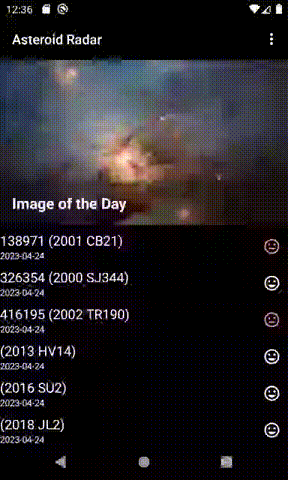

# Asteroid Radar 	☄️

[](https://android-arsenal.com/api?level=24)

Project created for the Udacity nanodegree Android Kotlin Developer program.

Asteroid Radar is an app to view the asteroids detected by NASA that pass near Earth, you can view all the detected asteroids given a period of time with data such as the size, velocity, distance to earth and if they are potentially hazardous. In this project I practiced skills such as fetching data from the internet, saving data to a database, and display the data in a clear, compelling UI.


|  |  |
| ------ | ------ |

## Key Features ✨

- RecyclerView
- Room
- Coroutines
- Network (Retrofit)
- Moshi
- Caching
- Navigation
- ViewModel
- LiveData
- Data Binding

## Project Milestones

- Create and reuse views in an Android app using RecyclerView
- Build an application that connects to an internet server to retrieve and display live data
- Use networking and image best practices to fetch data and images
- Create a database to store and access user data over time
- Implement offline caching to allow users to interact with online content offline
- Add talkback and push-button navigation to make an Android app accessible

## Installation

The first step is to get an API Key from NASA.
Got to the following URL - https://api.nasa.gov/ and generate API Key

Put it in the Constant
```sh
const val API_KEY = "<NASA_API_KEY>"
```

## Overview

The resulting output of the project are two screens: a Main screen with a list of all the detected asteroids and a Details screen that is going to display the data of that asteroid once it´s selected in the Main screen list. The main screen will also show the NASA image of the day.

|  |  |
| ------ | ------ |